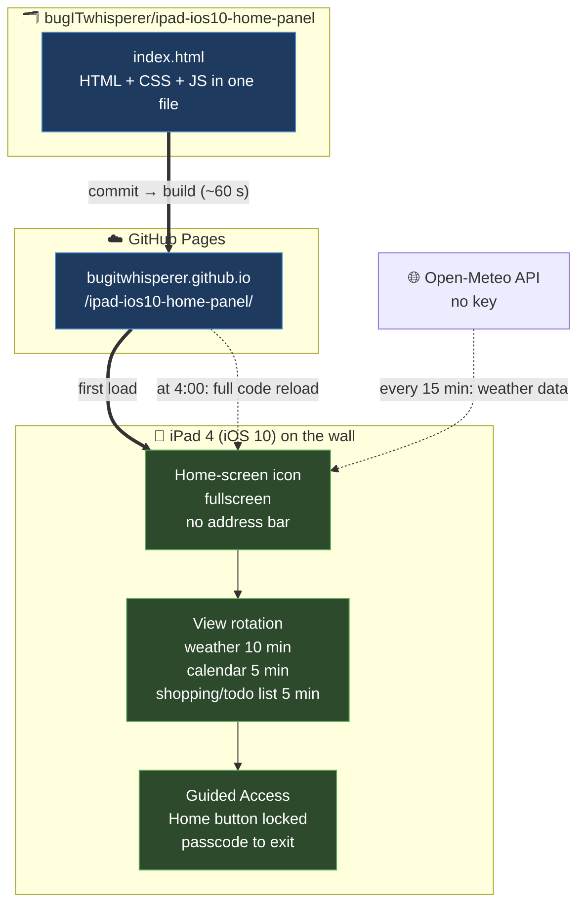

# 🌤️📅📝 Home panel on an old iPad

[🇵🇱 Polski](README.md) · **🇬🇧 English**

_By **Emilia Miller** (`bugITwhisperer`)_

> **One HTML file, zero dependencies, a 2012 iPad stuck on iOS 10** <br>
> No modern weather app will install on it, so the page is written around its limits instead

**Live:** <https://bugitwhisperer.github.io/ipad-ios10-home-panel/>

---

## 📑 Table of contents

- [Why this exists](#-why-this-exists)
- [Three views](#-three-views)
- [What the weather view shows](#-what-the-weather-view-shows)
- [Night mode](#-night-mode)
- [How it works](#-how-it-works)
- [iOS 10 constraints](#-ios-10-constraints)
- [Refresh cycles](#-refresh-cycles)
- [Changing the city](#-changing-the-city)
- [iPad settings](#-ipad-settings)
- [Roadmap](#️-roadmap)

---

## 🤔 Why this exists

A 4th-generation iPad (**A1458**, 2012) tops out at **iOS 10** — Apple support ended long ago. <br>
The App Store won't install the IKEA Home smart app, or any current weather app either. <br>
So instead: one static page, written in the old syntax this Safari still understands.

| Layer      | Choice                               | Reason                            |
| ---------- | ------------------------------------ | --------------------------------- |
| **Data**   | [Open-Meteo](https://open-meteo.com) | free API, no key                  |
| **Host**   | GitHub Pages                         | static HTML, nothing to maintain  |
| **Code**   | single `index.html`                  | HTML + CSS + JS together          |
| **Syntax** | ES5, old CSS                         | anything newer breaks on iOS 10   |

---

## 🔀 Three views

The panel rotates through three views on its own. Weather gets half the loop.

| View         | Time on screen | Status               |
| ------------ | -------------- | -------------------- |
| **Weather**  | 10 min         | ✅ working            |
| **Calendar** | 5 min          | 🚧 placeholder (B)   |
| **Shopping** | 5 min          | 🚧 placeholder (C)   |

- a full loop takes **20 minutes**
- tabs at the top switch views manually
- touching the screen **pauses rotation for 5 min**, counted from the last touch

---

## 👀 What the weather view shows

**Current conditions** at the top: temperature, icon, wind, precipitation

Below that, **two hourly strips at once**:

| Strip     | Range                                          | Control        |
| --------- | ---------------------------------------------- | -------------- |
| **Upper** | today, from the current hour through 23:00     | always visible |
| **Lower** | tomorrow hourly (from sunrise), or 3/5/7 days  | dropdown       |

Every cell: **temperature · icon · chance of rain · wind**

- hours that have passed **disappear** rather than being dimmed
- sunrise and sunset **no longer bound** the strip — they only drive night mode
- the daily forecast starts tomorrow, so today isn't shown twice
- no network or an API error → a message on screen, retry after a minute
- a missing value from the API → `--`, never `NaN`

---

## 🌙 Night mode

| When                     | What happens                                       |
| ------------------------ | -------------------------------------------------- |
| **00:30**                | screen goes dark, rotation stops                   |
| **5 min before sunrise** | lights up on its own, rotation resumes             |
| **touch at night**       | full interface for 30 s, views can still be switched |
| **another touch**        | timer restarts at a full 30 s                      |

Sunrise comes from the API, but it is pinned to the **current calendar day** — otherwise a `sunrise` carrying another date would darken the screen in the evening.

---

## 🎯 How it works



---

## 🚫 iOS 10 constraints

The code deliberately sticks to ES5 and old CSS.
Tests keep anything newer from slipping in — a static scan rejects the banned constructs:

| ❌ Not allowed                         | ✅ Use instead                          |
| ------------------------------------- | --------------------------------------- |
| `let`, `const`, `=>`, backticks       | `var`, `function`                       |
| `fetch`, `Promise`, `async` / `await` | `XMLHttpRequest`                        |
| `.includes()`, spread `...`, `class`  | `.indexOf()`, `for` loop                |
| CSS custom properties (`--var`)       | literal values                          |
| `gap`, CSS grid, `clamp()`, `:is()`   | margins, flexbox with `-webkit-` prefix |

For something running for weeks, what's **absent** matters too: every timer lives in a single variable and is cleared before a new one is set, and views are hidden by class rather than removed from the DOM.

---

## 🔄 Refresh cycles

| What                 | When                 | Mechanism                             |
| -------------------- | -------------------- | ------------------------------------- |
| **View rotation**    | 20-minute loop       | `setTimeout`, one at a time           |
| **Weather data**     | every 15 min         | `setInterval(load, 900000)`           |
| **Screen state**     | every minute         | checks whether night or dawn has come |
| **Page code**        | daily at 4:00 am     | `location.replace` + `?v=<timestamp>` |
| **Publish from repo**| on every commit      | GitHub Pages, ~60 s                   |
| **Retry**            | after a minute       | only after a network or API error     |

---

## 📍 Changing the city

Currently set to Lublin, Poland.<br>
Changing it means updating the coordinates in the script:

```js
var LAT = 51.2465;
var LON = 22.5684;
```

- coordinates from Google Maps: right-click a point, first item in the menu
- timezone and sunrise/sunset come from the API automatically

---

## 📱 iPad settings

1. **Auto-Lock off** — `Settings → Display & Brightness → Auto-Lock → Never`
2. **Home-screen icon** — open <https://bugitwhisperer.github.io/ipad-ios10-home-panel/> in Safari → `Share` → `Add to Home Screen` → launch from the icon (the address bar disappears)
3. **Landscape rotation lock** — Control Centre, or the side switch (`Settings → General → Use Side Switch To:`)
4. **Guided Access** _(optional)_ — `Settings → General → Accessibility → Guided Access` — locks the Home button so a stray tap can't exit the page
   To start it: triple-click Home → `Start`. Same to exit, plus the passcode.

---

## 🗺️ Roadmap

| Stage | Feature                     | Status      | Notes                                                        |
| ----- | --------------------------- | ----------- | ------------------------------------------------------------ |
| **1** | Weather + forecast          | ✅ Done      | —                                                            |
| **A** | View rotation + night mode  | ✅ Done      | calendar and shopping are placeholders                       |
| **B** | Calendar                    | 📋 Planned  | a dedicated Google account invited to shared events          |
| **C** | Shopping list               | 📋 Planned  | Google Sheet, ticked off on the iPad                         |
| **2** | Rain radar                  | 📋 Planned  | RainViewer or IMGW; needs a map library, uncertain on iOS 10 |
| **3** | City search                 | 🅿️ Parked   | text field + Open-Meteo geocoding API                        |

Stages B and C need a middle layer a dedicated server:
- that would keep the secrets on its own side and hands the iPad ready-made JSON. <br>
- the page will move off GitHub Pages to the server while the repo stays as the source of the code
