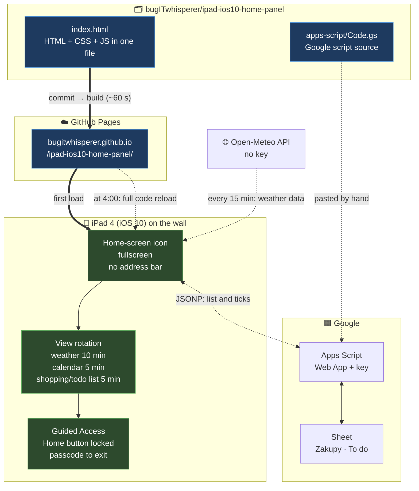

# 🌤️📅📝 Home Panel - iPad iOS 10

[🇵🇱 Polski](README.md) · **🇬🇧 English**

_By **Emilia Miller** (`bugITwhisperer`)_ <br>
_Built with Claude (Anthropic)_

> **One HTML file, zero dependencies on the iPad side, a 2012 iPad stuck on iOS 10** <br>

**Live:** <https://bugitwhisperer.github.io/ipad-ios10-home-panel/>

---

## 📑 Table of contents

- [Why this exists](#-why-this-exists)
- [Three views](#-three-views)
- [What the weather view shows](#-what-the-weather-view-shows)
- [Shopping/ToDo](#-shoppingtodo)
- [Night mode](#-night-mode)
- [Light/dark theme](#️-lightdark-theme)
- [How it works](#-how-it-works)
- [iOS 10 constraints](#-ios-10-constraints)
- [Refresh cycles](#-refresh-cycles)
- [Changing the city](#-changing-the-city)
- [iPad settings](#-ipad-settings)
- [Tests](#-tests)
- [Roadmap](#️-roadmap)

---

## 🤔 Why this exists

A 4th-generation iPad (**A1458**, 2012) tops out at **iOS 10** — Apple support ended long ago. <br>

One static page, written in the old syntax this Safari still understands:

| Layer      | Choice                               | Reason                            |
| ---------- | ------------------------------------ | --------------------------------- |
| **Data**   | [Open-Meteo](https://open-meteo.com) | free API, no key                  |
| **List**   | Google Sheet + Apps Script           | edited in the Sheets app, no server |
| **Host**   | GitHub Pages                         | static HTML, nothing to maintain  |
| **Code**   | single `index.html`                  | HTML + CSS + JS together          |
| **Syntax** | ES5, old CSS                         | anything newer breaks on iOS 10   |

---

## 🔀 Three views

The panel rotates through three views (tabs) on its own:

| View         | Time on screen | Status               |
| ------------ | -------------- | -------------------- |
| **Weather**  | 10 min         | ✅ working            |
| **Calendar** | 5 min          | 🚧 placeholder       |
| **Shopping/ToDo List** | 5 min          | ✅ working            |

- a full loop takes **20 minutes**
- tabs at the top switch views manually
- touching the screen **pauses rotation for 5 min**, counted from the last touch

---

## 👀 Weather

**Current conditions** at the top: temperature, icon, wind, precipitation

Below that, **two hourly strips at once**:

| Strip     | Range                                          | Control        |
| --------- | ---------------------------------------------- | -------------- |
| **Upper** | today, from the current hour through 23:00     | always visible |
| **Lower** | tomorrow hourly (from sunrise), or 3/5/7 days  | dropdown       |

Every cell: **temperature · icon · chance of rain · wind**

- hours that have passed **disappear** rather than being dimmed
- sunrise and sunset **no longer bound** the strip — they only drive night mode
- the daily forecast starts tomorrow, so today isn't shown twice
- no network or an API error → the last weather stays on screen marked "brak połączenia" (no connection), retry after a minute (only ever one pending)
- a missing value from the API → `--`, never `NaN`

---

## 📝 Shopping/ToDo List

Two columns side by side, **Zakupy** (shopping) and **ToDo**, read from two tabs of one Google Sheet (`Zakupy`, `To do`).<br>
Adding and editing happens in the Google Sheets app — the iPad only **displays and ticks off**.

| What               | How                                                              |
| ------------------ | ---------------------------------------------------------------- |
| **Tick off**       | tap an item → struck through at once, saved to the sheet in the background |
| **Undo**           | tap it again                                                     |
| **Save fails**     | the strike-through reverts, message "Nie udało się zapisać"      |
| **Done items**     | stay visible until midnight (Warsaw time), then hide             |
| **Long list**      | 7 items per column, then `+N więcej` (N more) — tap to expand   |
| **Long text**      | wraps onto more lines, nothing is cut off                        |
| **Fetching**       | when the view opens (rotation or tab), never on a timer          |
| **No network**     | the last list stays, marked `offline`                            |

### The sheet

"To-do list" template with checkboxes, data from row 4:

| A  | B    | C            | D                         |
| -- | ---- | ------------ | ------------------------- |
| ✓  | Date | Task / Item  | Completed at              |

Column **D** is filled by the script — the time an item was ticked, including ticks made in the Sheets app.<br>
Sheet time zone: `File → Settings → (GMT+01:00) Berlin`.

### Google script (`apps-script/Code.gs`)

1. In the Google Sheet: `Extensions → Apps Script`, paste the whole of `apps-script/Code.gs`
2. Run `generateKey`
3. `Deploy → New deployment → Web app`, **Execute as: Me**, **Who has access: Anyone** — not "Anyone with Google account": the home-screen app isn't signed in to Google
4. After every code change: `Deploy → Manage deployments → ✏️ → Version: New version`
5. On the iPad, in the Zakupy/ToDo tab: paste `https://script.google.com/macros/s/…/exec?key=KEY` → `Zapisz` (Save)

> 🔐 The key is stored only in the browser storage on the iPad.
> The "zmień adres" (change address) link under the list replaces it. If the URL ever leaks: run `generateKey` again + a new deployment version.

[`health-check/list.html`](https://bugitwhisperer.github.io/ipad-ios10-home-panel/health-check/list.html) — health check: can the iPad reach the Google script (the address without the key is enough; an `auth` answer also means the connection works)

---

## 🌙 Night mode

| When                     | What happens                                       |
| ------------------------ | -------------------------------------------------- |
| **00:30**                | screen goes dark, rotation stops                   |
| **5 min before sunrise** | lights up on its own, rotation resumes             |
| **touch at night**       | full interface for 30 s, views can still be switched |
| **another touch**        | timer restarts at a full 30 s                      |

---

## ☀️ Light/dark theme

A button next to the tabs switches the look. The icon shows the theme you will **get**: ☀️ in dark, 🌙 in light.

---

## 🎯 How it works



---

## 🚫 iOS 10 constraints

The code deliberately sticks to ES5 and old CSS.<br>
Tests keep anything newer from slipping in — a static scan rejects the banned constructs:

| ❌ Not allowed                         | ✅ Use instead                          |
| ------------------------------------- | --------------------------------------- |
| `let`, `const`, `=>`, backticks       | `var`, `function`                       |
| `fetch`, `Promise`, `async` / `await` | `XMLHttpRequest`                        |
| XHR to Apps Script (blocked by CORS)  | JSONP — the answer comes as a `<script>` tag |
| `flex: 1 1 0` (Safari ignores bare `0`) | `flex: 1 1 0%` + `width: 0`           |
| `.includes()`, spread `...`, `class`  | `.indexOf()`, `for` loop                |
| CSS custom properties (`--var`)       | literal values                          |
| `gap`, CSS grid, `clamp()`, `:is()`   | margins, flexbox with `-webkit-` prefix |

---

## 🔄 Refresh cycles

| What                 | When                 | Mechanism                             |
| -------------------- | -------------------- | ------------------------------------- |
| **View rotation**    | 20-minute loop       | `setTimeout`, one at a time           |
| **Weather data**     | every 15 min         | `setInterval(load, 900000)`           |
| **Screen state**     | every minute         | checks whether night or dawn has come |
| **Page code**        | daily at 4:00 am     | `location.replace` + `?v=<timestamp>` |
| **Publish from repo**| on every commit      | GitHub Pages, ~60 s                   |
| **Shopping/ToDo list** | when the view opens | JSONP, 15 s timeout                  |
| **Retry**            | after a minute       | only after a network or API error, one at a time |

---

## 📍 Changing the city

Currently set to Lublin, Poland.<br>
Changing it means updating the coordinates in the script:

```js
var LAT = 51.2465;
var LON = 22.5684;
```

- coordinates from Google Maps: right-click a point, first item in the menu
- timezone and sunrise/sunset come from the API automatically

---

## 📱 iPad settings

1. **Auto-Lock off** — `Settings → Display & Brightness → Auto-Lock → Never`
2. **Home-screen icon** — open <https://bugitwhisperer.github.io/ipad-ios10-home-panel/> in Safari → `Share` → `Add to Home Screen` → launch from the icon (the address bar disappears)
3. **Landscape rotation lock** — Control Centre
4. **Guided Access** _(optional)_ — `Settings → General → Accessibility → Guided Access` — locks the Home button so a stray tap can't exit the page
<br>
To start it: triple-click Home → `Start`. Same to exit, plus the passcode.
5. **Script address in home-screen mode** — the home-screen app has **separate storage** from Safari, so the address with the key has to be pasted there (Zakupy/ToDo tab)

---

## 🧪 Tests

```bash
node --test
```

From the repo root, Node 22+. No network, no Google account, no browser — details in [`tests/TESTY.md`](tests/TESTY.md) (Polish).

| File                               | Tests | Scope                                                  |
| ---------------------------------- | ----- | ------------------------------------------------------ |
| `tests/test-panel.js`              | 56    | rotation, night mode, weather, theme, iOS 10 compatibility |
| `tests/test-todo-shopping-list.js` | 36    | Google script, list view, JSONP, layout on iOS 10      |

---

## 🗺️ Roadmap

| Stage | Feature                     | Status      | Notes                                                        |
| ----- | --------------------------- | ----------- | ------------------------------------------------------------ |
| **1** | Weather + forecast          | ✅ Done      | —                                                            |
| **A** | View rotation + night mode  | ✅ Done      | —                                                            |
| **—** | Light/dark theme            | ✅ Done      | —                                                            |
| **B** | Calendar                    | 📋 Planned  | a dedicated Google account invited to shared events          |
| **C** | Shopping/ToDo               | ✅ Done      | Google Sheet + Apps Script, JSONP, key stored only on the iPad |
| **2** | Rain radar                  | 📋 Planned  | RainViewer or IMGW; needs a map library, uncertain on iOS 10 |
| **3** | City search                 | 🅿️ Parked   | text field + Open-Meteo geocoding API                        |