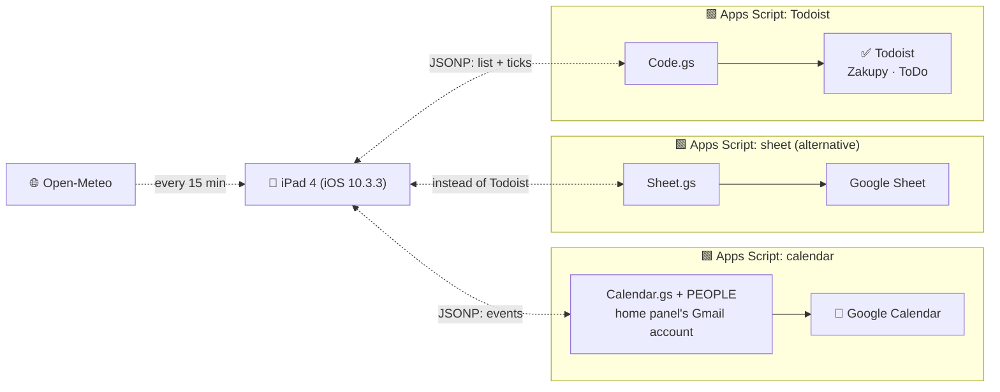
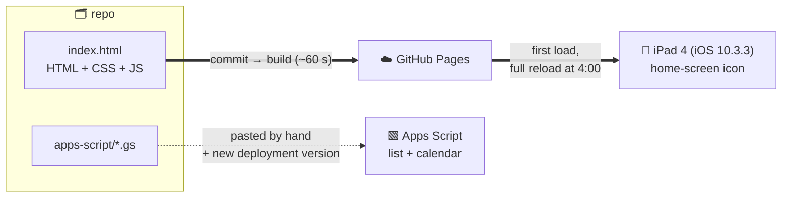

# 🌤️📅📝 Home Panel - iPad iOS 10

[🇵🇱 Polski](README.md) · **🇬🇧 English**

_By **Emilia Miller** (`bugITwhisperer`)_ <br>
_Built with Claude (Anthropic)_

> **One HTML file, zero dependencies on the iPad side, a 2012 iPad stuck on iOS 10** <br>

**Live:** <https://bugitwhisperer.github.io/ipad-ios10-home-panel/>

---

## 📑 Table of contents

- [Why this exists](#-why-this-exists)
- [Three views](#-three-views)
- [What the weather view shows](#-what-the-weather-view-shows)
- [Shopping/ToDo](#-shoppingtodo)
- [Calendar](#-calendar)
- [Night mode](#-night-mode)
- [Light/dark theme](#️-lightdark-theme)
- [How it works](#-how-it-works)
- [iOS 10 constraints](#-ios-10-constraints)
- [Refresh cycles](#-refresh-cycles)
- [Changing the city](#-changing-the-city)
- [iPad settings](#-ipad-settings)
- [Tests](#-tests)
- [Roadmap](#️-roadmap)

---

## 🤔 Why this exists

A 4th-generation iPad (**A1458**, 2012) tops out at **iOS 10.3.3** — Apple support ended long ago. <br>

A home wall panel with three views - weather, a Shopping/ToDo list and a calendar - written in the old syntax that Safari on iOS 10.3.3 still understands.

| View                   | Data source                                                  | Reason                               |
| ---------------------- | ------------------------------------------------------------ | ------------------------------------ |
| **Weather**            | [Open-Meteo](https://open-meteo.com)                         | free API, no key                     |
| **Shopping/ToDo List** | Todoist + Apps Script                                        | edited in the Todoist app, no server |
| **Calendar**           | Google Calendar of the home panel's Gmail account + Apps Script | only events that account is invited to reach the panel |

| What       | Choice              | Reason                            |
| ---------- | ------------------- | --------------------------------- |
| **Host**   | GitHub Pages        | static HTML, nothing to maintain  |
| **Code**   | single `index.html` | HTML + CSS + JS together          |
| **Syntax** | ES5, old CSS        | anything newer breaks on iOS 10   |

---

## 🔀 Three views

The panel rotates through three views (tabs) on its own:

| View                   | Time on screen |
| ---------------------- | -------------- |
| **Weather**            | 10 min         |
| **Calendar**           | 5 min          |
| **Shopping/ToDo List** | 5 min          |

- a full loop takes **20 minutes**
- tabs at the top switch views manually
- touching the screen **pauses rotation for 5 min**, counted from the last touch

---

## 👀 Weather

| Light | Dark |
| --- | --- |
|  |  |

**Current conditions** at the top: temperature, icon, wind, precipitation

Below that, **two hourly strips at once**:

| Strip     | Range                                          | Control        |
| --------- | ---------------------------------------------- | -------------- |
| **Upper** | today, from the current hour through 23:00     | always visible |
| **Lower** | tomorrow hourly (from sunrise), or 3/5/7 days  | segment `Jutro / 3 dni / 5 dni / 7 dni` above "DZISIAJ" |

Every cell: **temperature · icon · chance of rain · wind**

- hours that have passed **disappear** rather than being dimmed
- sunrise and sunset **no longer bound** the strip — they only drive night mode
- the daily forecast starts tomorrow, so today isn't shown twice
- no network or an API error → the last weather stays on screen marked "brak połączenia" (no connection), retry after a minute (only ever one pending)
- a missing value from the API → `--`, never `NaN`

---

## 📝 Shopping/ToDo List

| Light | Dark |
| --- | --- |
|  |  |

Two lists: **Zakupy** (shopping) and **ToDo**. The source is **Todoist** (or, as an alternative, a Google Sheet, see [Todoist vs Google Sheet](#todoist-vs-google-sheet)).<br>
Adding and editing happens in the Todoist (or Sheets) app — the iPad only **displays and ticks off**.

Segment `2w1 | Zakupy | ToDo` above the lists:
- **2w1** (2-in-1) — both lists side by side, 7 items per column
- **Zakupy** / **ToDo** — one list over two columns (1–7 and 8–14)

| What               | How                                                              |
| ------------------ | ---------------------------------------------------------------- |
| **Tick off**       | tap an item → struck through at once, saved in the background   |
| **Undo**           | tap it again (except Todoist recurring tasks)                    |
| **Save fails**     | the strike-through reverts, message "Nie udało się zapisać"      |
| **Done items**     | stay visible until midnight (Warsaw time), then hide             |
| **Long list**      | then `+N więcej` (N more) — tap to expand, folds back after 5 min idle |
| **Long text**      | wraps onto more lines, nothing is cut off                        |
| **Fetching**       | when the view opens (rotation or tab), never on a timer          |
| **No network**     | the last list stays, marked `offline`                            |

### Todoist vs Google Sheet

|                      | **Todoist** (in use)                                   | **Google Sheet** (alternative)               |
| -------------------- | ------------------------------------------------------ | ------------------------------------------- |
| **Script**           | `apps-script/Code.gs`                                  | `apps-script/Sheet.gs`                      |
| **Editing**          | Todoist app                                            | Google Sheets app                           |
| **Lists**            | projects `Zakupy` and `ToDo` (shared)                  | tabs `Zakupy` and `To do`                   |
| **Shows**            | no date, due today, overdue + done today               | everything not done + done today            |
| **Recurring tasks**  | ticked today stay visible, cannot be unticked          | none                                        |
| **Configuration**    | `KEY`, `TODOIST_TOKEN`, `ZAKUPY_PROJECT_ID`, `TODO_PROJECT_ID` | `KEY`                               |
| **Item id**          | Todoist task id                                        | row number                                  |

Both scripts answer the panel in the same shape, so switching needs no change on the iPad.

#### Todoist

The script sits between the iPad and Todoist and keeps the token, so it never reaches the iPad or the repo.

Script Properties (`Project Settings → Script Properties`):

| Name                | Value                                                              |
| ------------------- | ------------------------------------------------------------------ |
| `KEY`               | the key the iPad sends (created by `generateKey`)                  |
| `TODOIST_TOKEN`     | Todoist → `Settings → Integrations → Developer → API token`        |
| `ZAKUPY_PROJECT_ID` | id of the `Zakupy` project                                         |
| `TODO_PROJECT_ID`   | id of the `ToDo` project                                           |

After setting them: run `smokeTest` once and read the Execution log.

#### Google Sheet

"To-do list" template with checkboxes, data from row 4:

| A  | B    | C            | D                         |
| -- | ---- | ------------ | ------------------------- |
| ✓  | Date | Task / Item  | Completed at              |

Column **D** is filled by the script — the time an item was ticked, including ticks made in the Sheets app.
Unticking (on the iPad or in the Sheet) clears column **D**, so a re-ticked item is visible until midnight again (`onEdit` in the script).<br>
Sheet time zone: `File → Settings → (GMT+01:00) Berlin`.

Last pre-Todoist version: tag `v0.3.2-arkusz`. `Sheet.gs` is that version, adapted to the current panel.

#### Deploying the script

1. In the Google Sheet: `Extensions → Apps Script`, paste the whole of `apps-script/Code.gs` (Todoist) or `apps-script/Sheet.gs` (sheet) as `Code.gs`
2. Run `generateKey`
3. `Deploy → New deployment → Web app`, **Execute as: Me**, **Who has access: Anyone** — not "Anyone with Google account": the home-screen app isn't signed in to Google
4. After every code change: `Deploy → Manage deployments → ✏️ → Version: New version`
5. On the iPad, in the Zakupy/ToDo tab: paste `https://script.google.com/macros/s/…/exec?key=KEY` → `Zapisz` (Save)

> 🔐 The key is stored only in the browser storage on the iPad.
> The "zmień adres" (change address) link under the list replaces it. If the URL ever leaks: run `generateKey` again + a new deployment version.

[`health-check/list.html`](https://bugitwhisperer.github.io/ipad-ios10-home-panel/health-check/list.html) — health check: can the iPad reach the Google script (the address without the key is enough; an `auth` answer also means the connection works)

#### Switching Todoist ↔ sheet

1. In the Apps Script project bound to the sheet: replace the whole of `Code.gs` with the other script (`Sheet.gs` or `Code.gs` from the repo)
2. `Deploy → Manage deployments → ✏️ → Version: New version`
3. Nothing to change on the iPad: same URL and key

## 📅 Calendar

| Light | Dark |
| --- | --- |
|  |  |

Events from the home panel's Gmail account (e.g. `home.panel@…`, a dedicated account, not a personal one).<br>
Only events that account is **invited** to reach the panel — the iPad only displays.

| What                 | How                                                                  |
| -------------------- | -------------------------------------------------------------------- |
| **Left column**      | Today — finished events stay **struck through** until midnight        |
| **Right column**     | segment `Jutro / 3 / 5 / 7 dni` (tomorrow / days) above the columns, starting tomorrow |
| **Who**              | tag by creator: label and colour from `PEOPLE` (below), anyone else — login before `@` |
| **All-day**          | on top of the day as "cały dzień" (all day)                           |
| **Past midnight**    | on both days, the second one as "do 02:00" (until 02:00)              |
| **Many events**      | 5 per day, then `+N więcej` — struck-through ones are hidden first    |
| **Long title**       | wraps, nothing is cut off                                             |
| **Fetching**         | when the view opens, 8 days at once; the segment filters locally      |
| **No network**       | last data stays, marked `offline — aktualizacja HH:MM`                |

### Home panel's Gmail account

`Settings → Event settings → Add invitations to my calendar → Only if the sender is known`,
with the addresses from `PEOPLE` added to the home panel's Gmail account contacts. Time zone: Warsaw.

### Google script (`apps-script/Calendar.gs`)

A separate project on the home panel's Gmail account — it can only see that account's calendar.

1. Signed in as the home panel's Gmail account: [script.google.com](https://script.google.com) → `New project`, paste the whole of `apps-script/Calendar.gs`
2. `Project Settings` → time zone `(GMT+01:00) Warsaw`
3. `Project Settings → Script Properties`: add `PEOPLE` (optional, see below)
4. Run `generateKey`, allow calendar access, copy the key from the log
5. `Deploy → New deployment → Web app`, **Execute as: Me**, **Who has access: Anyone**
6. On the iPad, in the Kalendarz tab: paste `https://script.google.com/macros/s/…/exec?key=KEY` → `Zapisz`

| Light | Dark |
| --- | --- |
|  |  |

> 🔐 The calendar address has its own storage slot on the iPad (`gcalUrl`) — it never overwrites the list address.

### People and colours (`PEOPLE`)

Who gets which tag is set outside the code, in the calendar project's **Script Properties**:
`Apps Script → ⚙️ Project Settings → Script Properties → Add script property`

| Property | Value                                                  |
| -------- | ------------------------------------------------------ |
| `PEOPLE` | `address=label:#colour, address=label:#colour, …`      |

Example: `anna@example.com=A:#2e9e5b, piotr@example.com=P`

- **address** — the event creator's e-mail (case does not matter)
- **label** — tag text, e.g. a letter or a name
- **colour** — optional, `#rrggbb` only; missing or invalid → next from the palette: green, blue, orange, purple, pink, teal
- anyone not in `PEOPLE` → grey tag with the login before `@`; without `PEOPLE`, everyone
- no new deployment needed after changing it — the script reads it on every fetch
- the addresses never reach the repo or the iPad

---

## 🌙 Night mode

| When                     | What happens                                       |
| ------------------------ | -------------------------------------------------- |
| **00:30**                | screen goes dark, rotation stops                   |
| **5 min before sunrise** | lights up on its own, rotation resumes             |
| **touch at night**       | full interface for 30 s, views can still be switched |
| **another touch**        | timer restarts at a full 30 s                      |

---

## ☀️ Light/dark theme

A button next to the tabs switches the look. The icon shows the theme you will **get**: ☀️ in dark, 🌙 in light.

---

## 🎯 How it works

**Where the data comes from** - the panel's daily work:


```mermaid
graph LR
    IPAD["📱 iPad 4 (iOS 10.3.3)"]
    METEO["🌐 Open-Meteo"]
    subgraph G2["🟩 Apps Script: calendar"]
        CAL["Calendar.gs + PEOPLE<br/>home panel's Gmail account"] --> GCAL["📅 Google Calendar"]
    end
    subgraph G3["🟩 Apps Script: sheet (alternative)"]
        SHEET["Sheet.gs"] --> ARK["Google Sheet"]
    end
    subgraph G1["🟩 Apps Script: Todoist"]
        CODE["Code.gs"] --> TODO["✅ Todoist<br/>Zakupy · ToDo"]
    end
    METEO -. "every 15 min" .-> IPAD
    IPAD <-. "JSONP: events" .-> CAL
    IPAD <-. "instead of Todoist" .-> SHEET
    IPAD <-. "JSONP: list + ticks" .-> CODE
```

**Deployment** - how the code reaches the iPad and Google:


```mermaid
graph LR
    subgraph REPO["🗂️ repo"]
        HTML["index.html<br/>HTML + CSS + JS"]
        GS["apps-script/*.gs"]
    end
    PAGES["☁️ GitHub Pages"]
    IPAD["📱 iPad 4 (iOS 10.3.3)<br/>home-screen icon"]
    APPS["🟩 Apps Script<br/>list + calendar"]
    HTML == "commit → build (~60 s)" ==> PAGES
    PAGES == "first load,<br/>full reload at 4:00" ==> IPAD
    GS -. "pasted by hand<br/>+ new deployment version" .-> APPS
```

---

## 🚫 iOS 10 constraints

The code deliberately sticks to ES5 and old CSS.<br>
Tests keep anything newer from slipping in — a static scan rejects the banned constructs:

| ❌ Not allowed                         | ✅ Use instead                          |
| ------------------------------------- | --------------------------------------- |
| `let`, `const`, `=>`, backticks       | `var`, `function`                       |
| `fetch`, `Promise`, `async` / `await` | `XMLHttpRequest`                        |
| XHR to Apps Script (blocked by CORS)  | JSONP — the answer comes as a `<script>` tag |
| `flex: 1 1 0` (Safari ignores bare `0`) | `flex: 1 1 0%` + `width: 0`           |
| `.includes()`, spread `...`, `class`  | `.indexOf()`, `for` loop                |
| CSS custom properties (`--var`)       | literal values                          |
| `gap`, CSS grid, `clamp()`, `:is()`   | margins, flexbox with `-webkit-` prefix |

---

## 🔄 Refresh cycles

| What                 | When                 | Mechanism                             |
| -------------------- | -------------------- | ------------------------------------- |
| **View rotation**    | 20-minute loop       | `setTimeout`, one at a time           |
| **Weather data**     | every 15 min         | `setInterval(load, 900000)`           |
| **Screen state**     | every minute         | checks whether night or dawn has come |
| **Page code**        | daily at 4:00 am     | `location.replace` + `?v=<timestamp>` |
| **Publish from repo**| on every commit      | GitHub Pages, ~60 s                   |
| **Shopping/ToDo list** | when the view opens | JSONP, 15 s timeout                  |
| **Retry**            | after a minute       | only after a network or API error, one at a time |

---

## 📍 Changing the city

Currently set to Lublin, Poland.<br>
Changing it means updating the coordinates in the script:

```js
var LAT = 51.2465;
var LON = 22.5684;
```

- coordinates from Google Maps: right-click a point, first item in the menu
- timezone and sunrise/sunset come from the API automatically

---

## 📱 iPad settings

1. **Auto-Lock off** — `Settings → Display & Brightness → Auto-Lock → Never`
2. **Home-screen icon** — open <https://bugitwhisperer.github.io/ipad-ios10-home-panel/> in Safari → `Share` → `Add to Home Screen` → launch from the icon (the address bar disappears)
3. **Landscape rotation lock** — Control Centre
4. **Guided Access** _(optional)_ — `Settings → General → Accessibility → Guided Access` — locks the Home button so a stray tap can't exit the page
<br>
To start it: triple-click Home → `Start`. Same to exit, plus the passcode.
5. **Script address in home-screen mode** — the home-screen app has **separate storage** from Safari, so the address with the key has to be pasted there (Zakupy/ToDo tab)

---

## 🧪 Tests

```bash
node --test
```

From the repo root, Node 22+. No network, no Google account, no browser — details in [`tests/TESTY.md`](tests/TESTY.md) (Polish).

| File                               | Tests | Scope                                                  |
| ---------------------------------- | ----- | ------------------------------------------------------ |
| `tests/test-panel.js`              | 71    | rotation, night mode, weather, theme, iOS 10 compatibility |
| `tests/test-todo-shopping-list.js` | 59    | Todoist script, list view, JSONP, layout on iOS 10     |
| `tests/test-calendar.js`           | 33    | calendar script, calendar view, DST                    |
| `tests/test-segments.js`           | 13    | range segments, headers, smaller tiles, page name      |
| `tests/test-list-pick.js`          | 8     | `2w1 / Zakupy / ToDo` segment                          |
| `tests/test-sheet.js`              | 6     | Sheet script (`Sheet.gs`) compatible with the panel    |
| `tests/test-people.js`             | 7     | `PEOPLE`: calendar labels and colours                  |
| `tests/test-icons.js`              | 2     | home-screen and tab icons                              |

Layout in a browser (Playwright, 1024×768, both themes): `npm run layout`.<br>
README screenshots (`docs/screens/`, test data): `npm run screens`.

---

## 🗺️ Roadmap

| Feature                         | Status      | Notes                                                                 |
| ------------------------------- | ----------- | --------------------------------------------------------------------- |
| Weather + forecast              | ✅ Done      | —                                                                     |
| View rotation + night mode      | ✅ Done      | —                                                                     |
| Light/dark theme                | ✅ Done      | —                                                                     |
| Calendar                        | ✅ Done      | home panel's Gmail account + separate Apps Script, `PEOPLE`, key only on the iPad |
| Shopping/ToDo                   | ✅ Done      | Google Sheet + Apps Script, JSONP, key stored only on the iPad        |
| List on Todoist instead of the sheet | ✅ Done | Todoist + Apps Script; the sheet stays as an alternative (`Sheet.gs`) |
| Screen off at night             | 📋 Planned  | a small iPad app on a free Apple ID, refreshed by Sideloadly on a Mac mini (2012); a web page cannot keep iOS 10 awake |
| Sheet ↔ Todoist sync            | 📋 Planned  | new sheet items → Todoist, ticks both ways                            |
| Own server                      | 📋 Planned  | n8n on a VPS holds the tokens, panel on its own address; no script address with a key to paste on the iPad               |
| Rain radar                      | 📋 Planned  | RainViewer or IMGW; needs a map library, uncertain on iOS 10          |
| City search                     | 🅿️ Parked   | text field + Open-Meteo geocoding API                                 |

---

## 📄 License

[MIT](LICENSE) © Emilia Miller