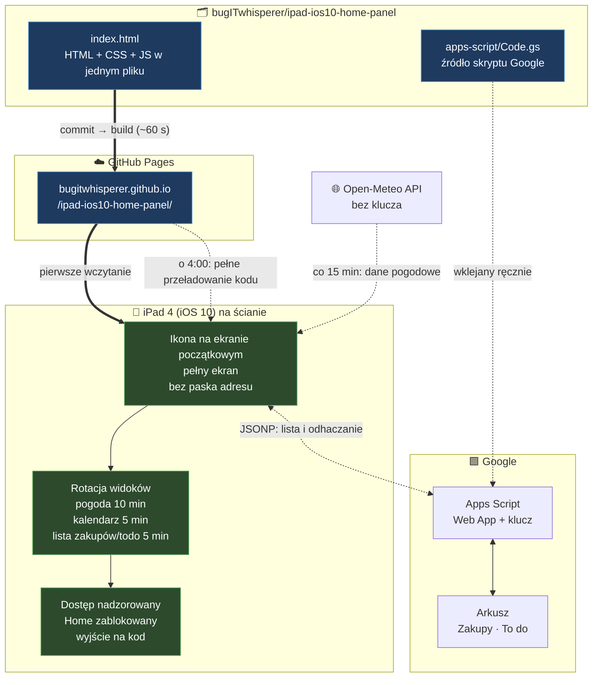

# 🌤️📅📝 Panel na starego iPada

**🇵🇱 Polski** · [🇬🇧 English](README.en.md)

_By **Emilia Miller** (`bugITwhisperer`)_

> **Jeden plik HTML, zero zależności po stronie iPada, iPad z 2012 roku z iOS 10.**
> Nie zadziała na nim żadna nowa app pogodowa stąd strona napisana pod jego ograniczenia.

**Na żywo:** <https://bugitwhisperer.github.io/ipad-ios10-home-panel/>

---

## 📑 Spis treści

- [Po co to](#-po-co-to)
- [Trzy widoki](#-trzy-widoki)
- [Co pokazuje pogoda](#-co-pokazuje-pogoda)
- [Zakupy/ToDo](#-zakupytodo)
- [Tryb nocny](#-tryb-nocny)
- [Motyw jasny/ciemny](#️-motyw-jasnyciemny)
- [Jak to działa](#-jak-to-działa)
- [Ograniczenia iOS 10](#-ograniczenia-ios-10)
- [Cykle odświeżania](#-cykle-odświeżania)
- [Zmiana miasta](#-zmiana-miasta)
- [Ustawienia iPada](#-ustawienia-ipada)
- [Testy](#-testy)
- [Plany](#️-plany)

---

## 🤔 Po co to

iPad 4. generacji (**A1458**, 2012) ma **iOS 10** - koniec wsparcia Apple.
App Store nie pozwoli zainstalować app IKEA Home smart ani innej "pogodówki".
Zamiast tego jedna statyczna strona w starej składni, którą Safari jeszcze rozumie

| Warstwa      | Wybór                                | Dlaczego                             |
| ------------ | ------------------------------------ | ------------------------------------ |
| **Dane**     | [Open-Meteo](https://open-meteo.com) | darmowe API                          |
| **Lista**    | Arkusz Google + Apps Script          | edycja w apce Sheets, bez serwera    |
| **Hosting**  | GitHub Pages                         | statyczny HTML                       |
| **Kod**      | jeden plik `index.html`              | HTML + CSS + JS razem                |
| **Składnia** | ES5, stary CSS                       | wszystko nowsze wywala się na iOS 10 |

---

## 🔀 Trzy widoki

Panel przełącza się sam między trzema widokami. Pogoda dostaje połowę czasu pętli.

| Widok         | Czas na ekranie | Stan                 |
| ------------- | --------------- | -------------------- |
| **Pogoda**    | 10 min          | ✅ działa             |
| **Kalendarz** | 5 min           | 🚧 zaślepka          |
| **Zakupy**    | 5 min           | ✅ działa             |

- pełna pętla trwa **20 minut**
- zakładki u góry pozwalają przełączyć widok ręcznie
- dotknięcie ekranu **wstrzymuje rotację na 5 min**, licznik liczony od ostatniego dotknięcia'
- przy kalendarzu i zakupach dropdown ustępuje miejsca **jednolinijkowej pogodzie bieżącej** — temperatura jest na oku niezależnie od widoku

---

## 👀 Co pokazuje pogoda

**Pogoda bieżąca** u góry: temperatura, ikona, wiatr, opady

Pod spodem **dwa paski godzinowe naraz**:

| Pasek     | Zakres                                      | Sterowanie      |
| --------- | ------------------------------------------- | --------------- |
| **Górny** | dzisiaj, od bieżącej godziny do 23:00       | zawsze widoczny |
| **Dolny** | jutro godzinowo (od wschodu) albo 3/5/7 dni | dropdown        |

Każdy kafelek: **temperatura · ikona · szansa opadów · wiatr**

- godziny, które minęły → **znikają**, nie są wyszarzane
- wschód i zachód **nie ograniczają** już paska - służą tylko trybowi nocnemu
- prognoza dzienna startuje od jutra, żeby nie dublować dzisiaj
- brak sieci lub błąd API → ostatnia pobrana pogoda zostaje na ekranie z dopiskiem „brak połączenia”, ponowna próba po minucie (zawsze tylko jedna czekająca)
- brakująca wartość z API → `--`, nigdy `NaN`

---

## 📝 Zakupy/ToDo

Dwie kolumny obok siebie: **Zakupy** i **ToDo**, z dwóch zakładek jednego arkusza Google (`Zakupy`, `To do`).
Dopisywanie i edycja w apce Google Sheets - iPad tylko **wyświetla i odhacza**.

| Co                     | Jak                                                                  |
| ---------------------- | -------------------------------------------------------------------- |
| **Odhaczenie**         | tapnięcie w pozycję → przekreślenie od razu, zapis w arkuszu w tle   |
| **Cofnięcie**          | ponowne tapnięcie                                                    |
| **Błąd zapisu**        | przekreślenie się cofa, komunikat „Nie udało się zapisać”            |
| **Zrobione**           | widoczne do północy (czas Warszawy), potem znikają                   |
| **Długa lista**        | 7 pozycji na kolumnę, dalej `+N więcej` - tapnięcie rozwija          |
| **Długi tekst**        | zawija się do kolejnych linii, nic nie jest ucinane                  |
| **Pobieranie**         | przy wejściu w widok (rotacja albo zakładka), nie z timera           |
| **Brak sieci**         | zostaje ostatnia lista z dopiskiem `offline`                         |

### Arkusz

Szablon „To-do list” z checkboxami, dane od wiersza 4:

| A  | B    | C              | D            |
| -- | ---- | -------------- | ------------ |
| ✓  | Date | Task / Item    | Completed at |

Kolumnę **D** wypełnia skrypt - godzina odhaczenia, także gdy ktoś odhaczy w apce Sheets.
Strefa czasowa arkusza: `Plik → Ustawienia → (GMT+01:00) Warsaw`.

### Skrypt Google (`apps-script/Code.gs`)

1. W arkuszu: `Rozszerzenia → Apps Script`, wkleić całą zawartość `apps-script/Code.gs`
2. Uruchomić funkcję `generateKey` - klucz pojawi się w `Execution log`
3. `Deploy → New deployment → Web app`, **Execute as: Me**, **Who has access: Anyone** - nie „Anyone with Google account”: aplikacja z ikony nie jest zalogowana do Google i zamiast listy dostałaby stronę logowania
4. Przy każdej zmianie kodu: `Deploy → Manage deployments → ✏️ → Version: New version` - adres zostaje ten sam
5. Na iPadzie, w zakładce Zakupy/ToDo: wkleić `https://script.google.com/macros/s/…/exec?key=KLUCZ` → `Zapisz`
6. The `Wyczyść` (Clear) button empties the field — handy when a pasted address is rejected

> 🔐 Klucz **nie trafia do repo** - repo jest publiczne. Zapisuje się tylko w pamięci przeglądarki na iPadzie.<br>
> Link „zmień adres” pod listą pozwala go podmienić. Gdy adres wycieknie: ponownie `generateKey` + nowa wersja wdrożenia.

[`health-check/list.html`](https://bugitwhisperer.github.io/ipad-ios10-home-panel/health-check/list.html) - health check: czy iPad łączy się ze skryptem Google (adres bez klucza wystarczy, odpowiedź `auth` też oznacza, że połączenie działa).

---

## 🌙 Tryb nocny

| Kiedy                    | Co się dzieje                                   |
| ------------------------ | ----------------------------------------------- |
| **00:30**                | ekran ciemnieje, rotacja staje                  |
| **5 min przed wschodem** | rozjaśnia się sam, rotacja rusza                |
| **dotknięcie w nocy**    | pełny interfejs na 30 s, można przełączać widok |
| **kolejne dotknięcie**   | licznik od nowa, pełne 30 s                     |

Godzina wschodu przychodzi z API, ale jest przypinana do **bieżącego dnia kalendarzowego** - inaczej `sunrise` z innej daty gasił ekran już wieczorem.

---

## ☀️ Motyw jasny/ciemny

Przycisk obok zakładek przełącza wygląd. Ikona pokazuje motyw **docelowy**: ☀️ w ciemnym, 🌙 w jasnym.

- wybór zapisuje się na iPadzie i przeżywa przeładowanie o 4:00
- domyślnie ciemny - także gdy zapis jest nieczytelny
- jasny jest szary, nie biały - łagodniejszy dla starego ekranu
- tryb nocny zawsze gasi na czarno, a o świcie wraca wybrany motyw

---

## 🎯 Jak to działa



---

## 🚫 Ograniczenia iOS 10

Kod celowo trzyma się ES5 i starego CSS-a<br>
Testy pilnują, żeby nic nowszego się nie wślizgnęło - statyczny skan odrzuca zakazane konstrukcje:

| ❌ Nie wolno                           | ✅ Zamiast tego                            |
| ------------------------------------- | ----------------------------------------- |
| `let`, `const`, `=>`, backticki       | `var`, `function`                         |
| `fetch`, `Promise`, `async` / `await` | `XMLHttpRequest`                          |
| XHR do Apps Script (blokada CORS)     | JSONP - odpowiedź jako tag `<script>`     |
| `flex: 1 1 0` (Safari ignoruje `0`)   | `flex: 1 1 0%` + `width: 0`               |
| `.includes()`, spread `...`, `class`  | `.indexOf()`, pętla `for`                 |
| CSS custom properties (`--zmienna`)   | Wartości wpisane wprost                   |
| `gap`, CSS grid, `clamp()`, `:is()`   | Marginesy, flexbox z prefiksem `-webkit-` |

Przy wielodniowej pracy liczy się też to, czego **nie ma**: każdy timer trzymany jest w jednej zmiennej i czyszczony przed ustawieniem nowego, a widoki są chowane klasą zamiast usuwane z DOM.

---

## 🔄 Cykle odświeżania

| Co                    | Kiedy                  | Mechanizm                             |
| --------------------- | ---------------------- | ------------------------------------- |
| **Rotacja widoków**   | pętla 20 min           | `setTimeout`, jeden na raz            |
| **Dane pogodowe**     | co 15 min              | `setInterval(load, 900000)`           |
| **Stan ekranu**       | co minutę              | sprawdzenie, czy zapada noc lub świt  |
| **Kod strony**        | codziennie o 4:00 rano | `location.replace` + `?v=<timestamp>` |
| **Publikacja z repo** | po każdym commicie     | GitHub Pages, ~60 s                   |
| **Lista Zakupy/ToDo** | przy wejściu w widok   | JSONP, timeout 15 s                   |
| **Ponowna próba**     | po minucie             | Tylko po błędzie sieci lub API, jedna naraz |

---

## 📍 Zmiana miasta

Ustawione miasto: Lublin.
Zmiana miasta wymaga aktualizacji współrzędnych w skrypcie:

```js
var LAT = 51.2465;
var LON = 22.5684;
```

- współrzędne z Google Maps: prawy przycisk na punkcie, pierwsza pozycja w menu
- strefa czasowa i godziny wschodu/zachodu przyjdą z API automatycznie

---

## 📱 Ustawienia iPada

1. **Autoblokada wyłączona** `Ustawienia → Ekran i jasność → Autoblokada → Nigdy`
2. **Ikona na ekranie początkowym** Wejść na stronę <https://bugitwhisperer.github.io/ipad-ios10-home-panel/> w Safari → `Udostępnij` → `Dodaj do ekranu początkowego` → uruchom z ikony (pasek adresu znika)
3. **Blokada orientacji poziomej** Centrum sterowania albo przełącznik boczny (`Ustawienia → Ogólne → Użyj przełącznika bocznego do:`)
4. **Dostęp nadzorowany** _(opcjonalnie)_ `Ustawienia → Ogólne → Dostępność → Dostęp nadzorowany` — blokuje przycisk Home, żeby przypadkowe dotknięcie nie wyrzuciło z aplikacji
   Wyjście z trybu dostępu nadzorowanego: potrójne kliknięcie Home → `Rozpocznij`.
5. **Adres skryptu w trybie z ikony** - aplikacja z ikony ma **osobną pamięć** niż Safari, więc adres z kluczem trzeba wkleić właśnie tam (zakładka Zakupy/ToDo)

---

## 🧪 Testy

```bash
node --test
```

Z głównego folderu, Node 22+. Bez sieci, bez konta Google, bez przeglądarki - szczegóły w [`tests/TESTY.md`](tests/TESTY.md).

| Plik                               | Testów | Zakres                                              |
| ---------------------------------- | ------ | --------------------------------------------------- |
| `tests/test-panel.js`              | 56     | rotacja, tryb nocny, pogoda, motyw, zgodność iOS 10 |
| `tests/test-todo-shopping-list.js` | 36     | skrypt Google, widok listy, JSONP, układ na iOS 10  |

---

## 🗺️ Plany

| Etap  | Funkcja                      | Stan           | Uwagi                                                              |
| ----- | ---------------------------- | -------------- | ------------------------------------------------------------------ |
| **1** | Pogoda + prognoza            | ✅ Gotowe       | —                                                                  |
| **A** | Rotacja widoków + tryb nocny | ✅ Gotowe       | —                                                                  |
| **—** | Motyw jasny/ciemny           | ✅ Gotowe       | —                                                                  |
| **B** | Kalendarz                    | 📋 Planowane   | dedykowane konto Google zapraszane na wspólne wydarzenia           |
| **C** | Zakupy/ToDo                  | ✅ Gotowe       | arkusz Google + Apps Script, JSONP, klucz tylko na iPadzie         |
| **2** | Radar opadów                 | 📋 Planowane   | RainViewer lub IMGW; wymaga biblioteki mapowej, na iOS 10 niepewne |
| **3** | Wyszukiwarka miast           | 🅿️ Zaparkowane | Pole tekstowe + geocoding API Open-Meteo                           |

Lista Zakupy/ToDo obyła się bez własnego serwera: sekret (klucz) siedzi tylko na iPadzie, a Apps Script odpowiada przez JSONP, bo iOS 10 nie przepuszcza do niego zwykłych zapytań (CORS). Strona zostaje na GitHub Pages.
Kalendarz prawdopodobnie da się zrobić tym samym wzorcem - do sprawdzenia przy planowaniu.
