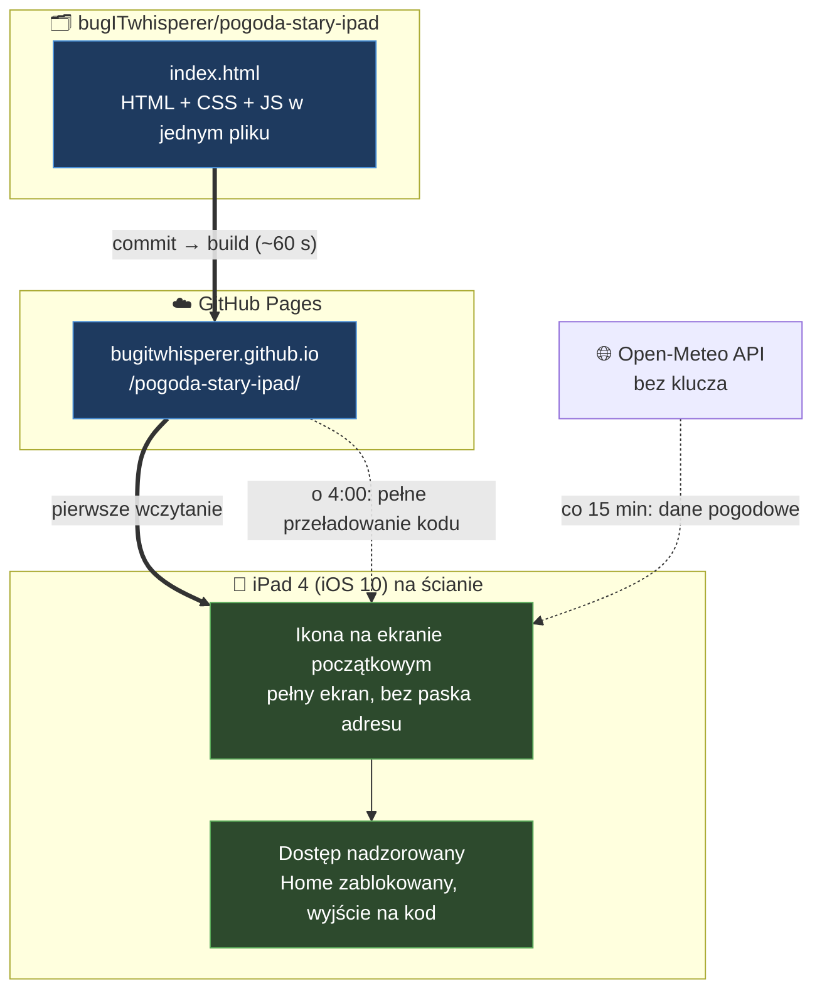

# 🌤️ Panel pogodowy na starego iPada

_By **Emilia Miller** (`bugITwhisperer`)_

> **Jeden plik HTML, zero zależności, iPad z 2012 roku z iOS 10.** <br>
>  Nie zadziała na nim żadna nowa app pogodowa stąd strona napisana pod jego ograniczenia.

**Na żywo:** <https://bugitwhisperer.github.io/pogoda-stary-ipad/>

---

## 📑 Spis treści

- [Po co to](#-po-co-to)
- [Co pokazuje](#-co-pokazuje)
- [Jak to działa](#-jak-to-działa-w-jednym-diagramie)
- [Ograniczenia iOS 10](#-ograniczenia-ios-10)
- [Cykle odświeżania](#-cykle-odświeżania)
- [Zmiana miasta](#-zmiana-miasta)
- [Ustawienia iPada](#-ustawienia-ipada)

---

## 🤔 Po co to

iPad 4. generacji (**A1458**, 2012) ma **iOS 10** - koniec wsparcia Apple. <br>
App Store nie pozwoli zainstalować app IKEA Home smart ani innej "pogodówki". <br>
Zamiast tego jedna statyczna strona w starej składni, którą Safari jeszcze rozumie

| Warstwa       | Wybór                    | Dlaczego                                       |
| ------------- | ------------------------ | ---------------------------------------------- |
| **Dane**      | [Open-Meteo](https://open-meteo.com) | darmowe API |
| **Hosting**   | GitHub Pages             | statyczny HTML          |
| **Kod**       | jeden plik `index.html`  | HTML + CSS + JS razem   |
| **Składnia**  | ES5, stary CSS           | wszystko nowsze wywala się na iOS 10           |

---

## 👀 Co pokazuje

**Pogoda bieżąca** u góry ekranu: temperatura, ikona, wiatr, opady

**Przełącznik widoku** w prawym górnym rogu:

| Widok        | Zawartość                                        |
| ------------ | ------------------------------------------------ |
| **Dzisiaj**  | godzinowo, od wschodu do zachodu słońca          |
| **3 dni**    | prognoza dzienna, temperatura max/min na 3 dni   |
| **5 dni**    | prognoza dzienna, temperatura max/min na 5 dni   |

- godziny, które już minęły → wyszarzone, ale nadal widoczne
- wschód i zachód słońca → wyróżniona ramka
- po zachodzie słońca → komunikat zamiast doby nieaktualnych danych
- brak sieci lub błąd API → komunikat na ekranie, ponowna próba po minucie
- brakująca wartość z API → `--`, nigdy `NaN`

---

## 🎯 Jak to działa



---

## 🚫 Ograniczenia iOS 10

Kod celowo trzyma się ES5 i starego CSS-a <br>
[Testy](#-testy) pilnują, żeby nic nowszego się nie wślizgnęło - statyczny skan odrzuca zakazane konstrukcje:

| ❌ Nie wolno                              | ✅ Zamiast tego                              |
| ----------------------------------------- | -------------------------------------------- |
| `let`, `const`, `=>`, backticki           | `var`, `function`                            |
| `fetch`, `Promise`, `async` / `await`     | `XMLHttpRequest`                             |
| `.includes()`, spread `...`, `class`      | `.indexOf()`, pętla `for`                    |
| CSS custom properties (`--zmienna`)       | Wartości wpisane wprost                      |
| `gap`, CSS grid, `clamp()`, `:is()`       | Marginesy, flexbox z prefiksem `-webkit-`    |

---

## 🔄 Cykle odświeżania

| Co                       | Kiedy              | Mechanizm                                    |
| ------------------------ | ------------------ | -------------------------------------------- |
| **Dane pogodowe**        | co 15 min          | `setInterval(load, 900000)`                  |
| **Kod strony**           | codziennie o 4:00 rano  | `location.replace` + `?v=<timestamp>`        |
| **Publikacja z repo**    | po każdym commicie | GitHub Pages, ~60 s                          |
| **Ponowna próba**        | po minucie         | Tylko po błędzie sieci lub API               |

---

## 📍 Zmiana miasta

Ustawione miasto: Lublin. <br>
Zmiana miasta wymaga aktualizacji współrzędnych w skrypcie:

```js
var LAT = 51.2465;
var LON = 22.5684;
```

- współrzędne z Google Maps: prawy przycisk na punkcie, pierwsza pozycja w menu
- strefa czasowa i godziny wschodu/zachodu przyjdą z API automatycznie

---

## 📱 Ustawienia iPada

1. **Autoblokada wyłączona**
   `Ustawienia → Ekran i jasność → Autoblokada → Nigdy`
2. **Ikona na ekranie początkowym**
   Wejść na stronę https://bugitwhisperer.github.io/pogoda-stary-ipad/ w Safari → `Udostępnij` → `Dodaj do ekranu początkowego` → uruchom z ikony (pasek adresu znika)
3. **Blokada orientacji poziomej**
   Centrum sterowania albo przełącznik boczny (`Ustawienia → Ogólne → Użyj przełącznika bocznego do:`)
4. **Dostęp nadzorowany** _(opcjonalnie)_
   `Ustawienia → Ogólne → Dostępność → Dostęp nadzorowany` — blokuje przycisk Home, żeby przypadkowe dotknięcie nie wyrzuciło z aplikacji
   Wyjście z trybu dostępu nadzorowanego: potrójne kliknięcie Home → `Rozpocznij`.

---

## 🗺️ Plany

| Etap  | Funkcja                | Stan            | Uwagi                                                                 |
| ----- | ---------------------- | --------------- | --------------------------------------------------------------------- |
| **1** | Pogoda + prognoza      | ✅ Gotowe       | —                                                                     |
| **2** | Radar opadów           | 📋 Planowane    | RainViewer lub IMGW; wymaga biblioteki mapowej, na iOS 10 niepewne    |
| **3** | Wyszukiwarka miast     | 🅿️ Zaparkowane  | Pole tekstowe + geocoding API Open-Meteo                              |
