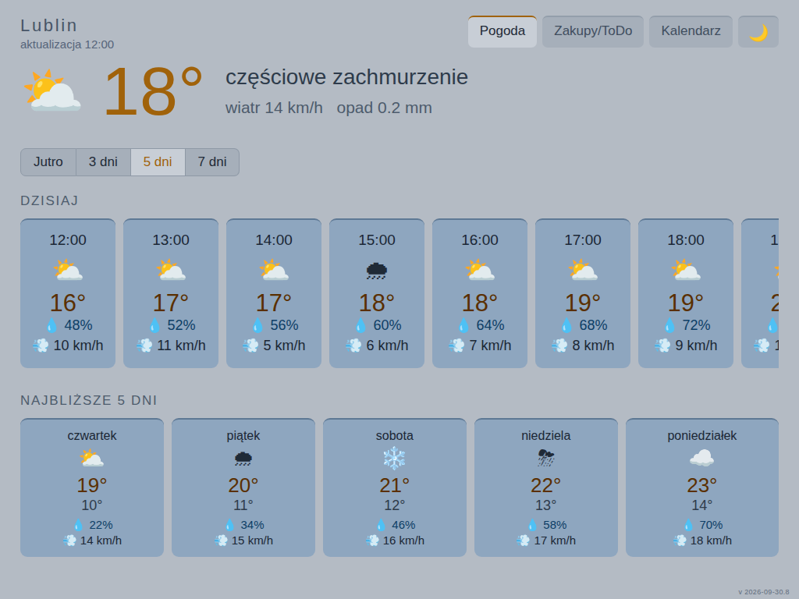
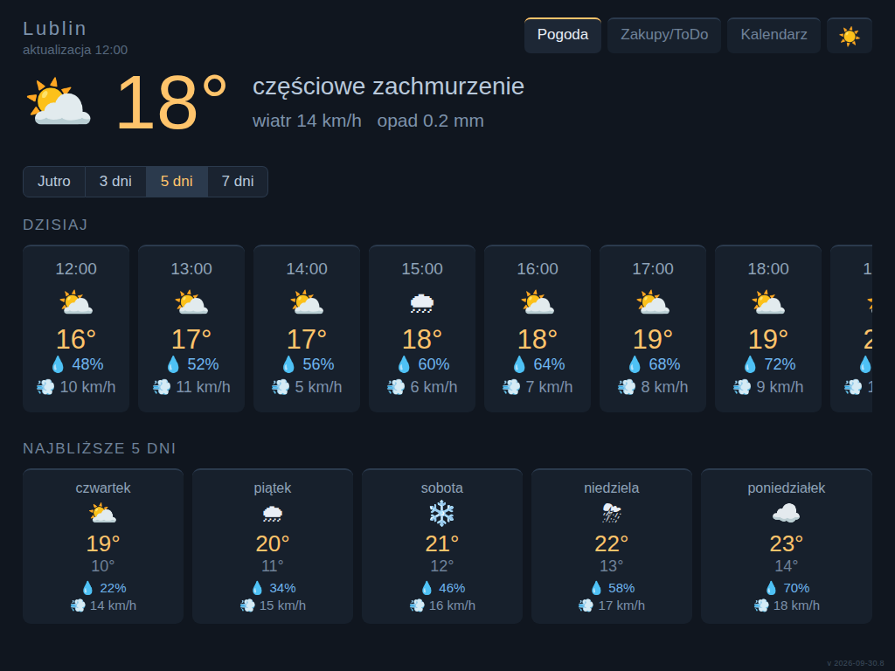
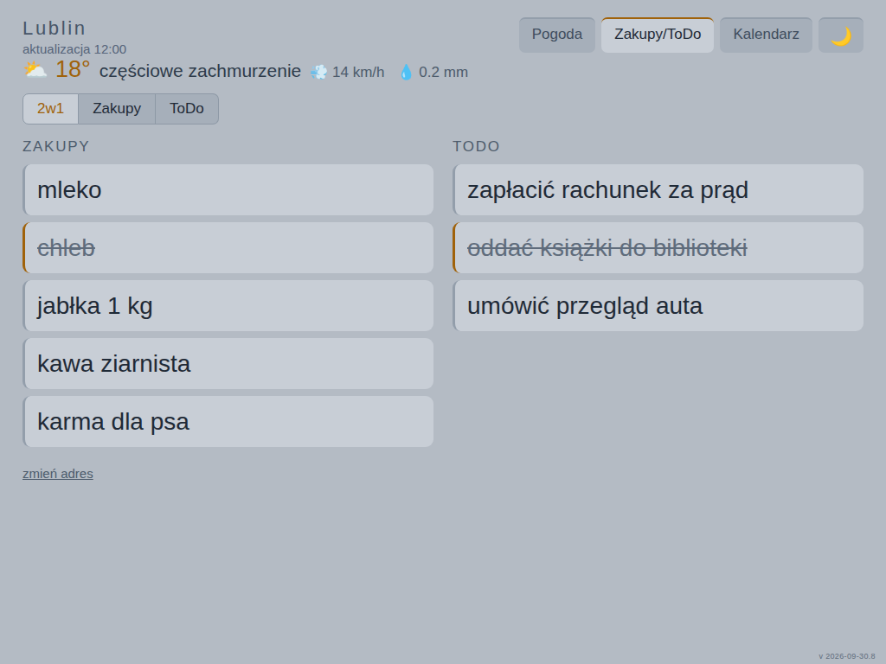
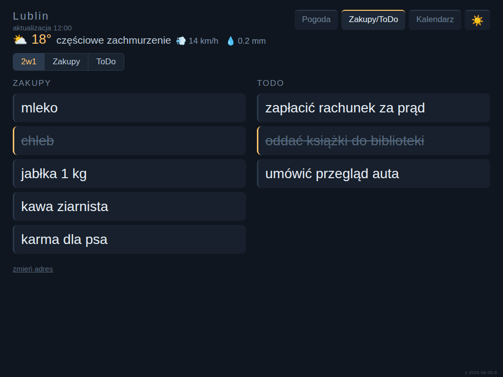
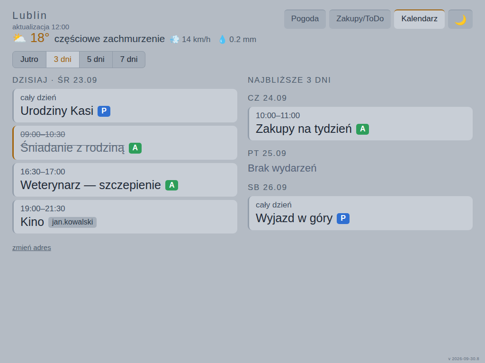
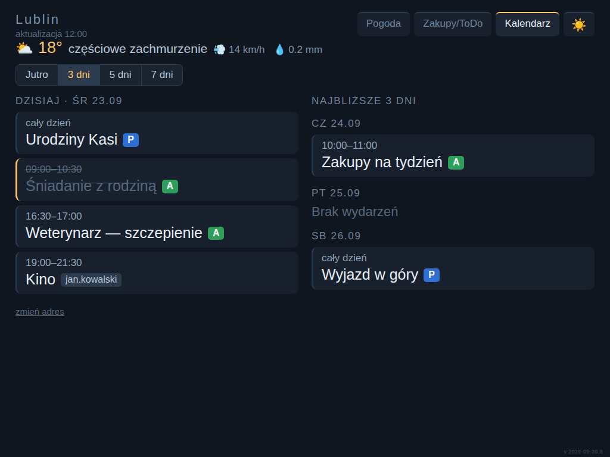
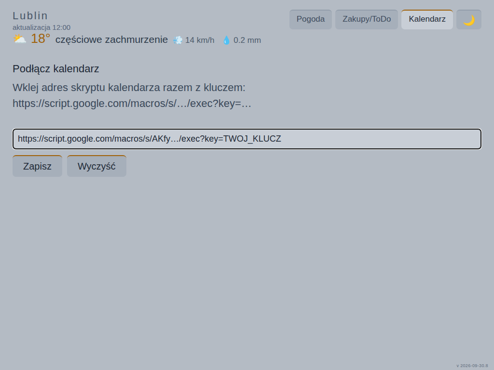
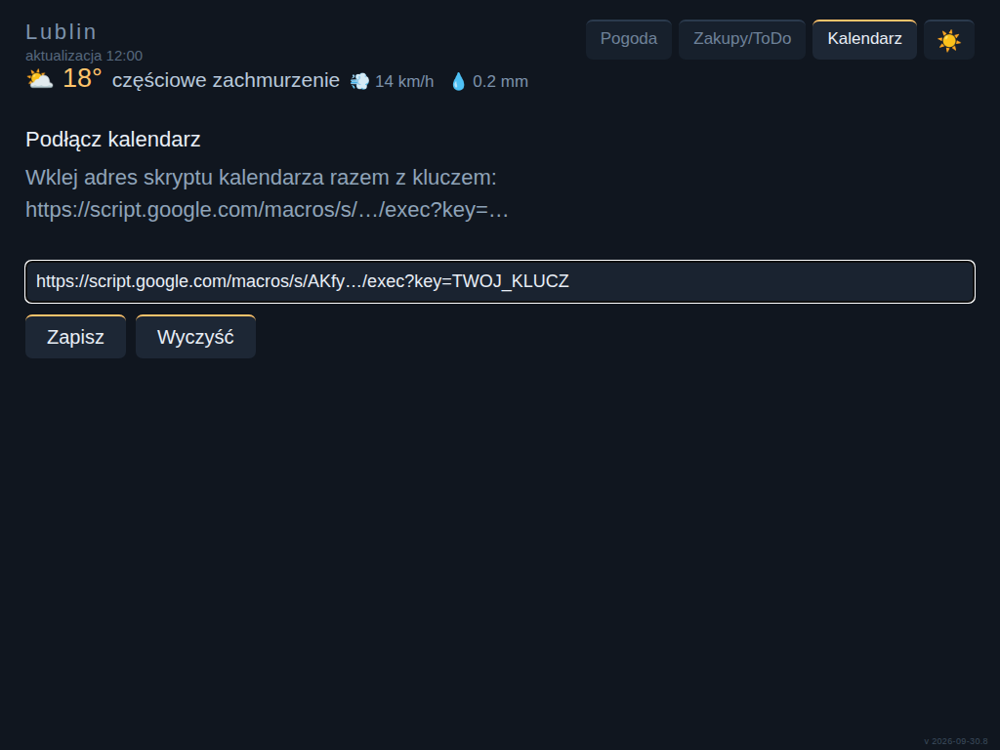
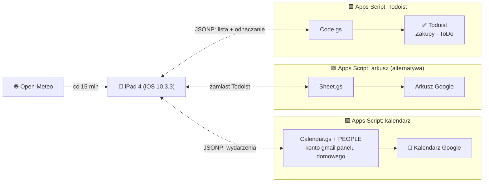
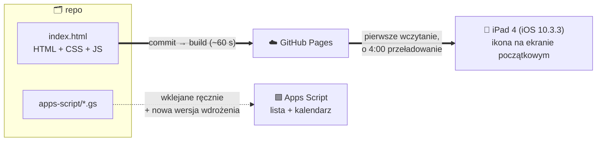

# 🌤️📅📝 Home Panel - iPad iOS 10

**🇵🇱 Polski** · [🇬🇧 English](README.en.md)

_By **Emilia Miller** (`bugITwhisperer`)_ <br>
_Napisane z Claude (Anthropic)_

> **Jeden plik HTML - zero zależności po stronie iPada (2012 rok, iOS 10) - panel z 3 widokami: pogoda, lista zakupów/todo, kalendarz**

**Na żywo:** <https://bugitwhisperer.github.io/ipad-ios10-home-panel/>

---

## 📑 Spis treści

- [O co chodzi](#-o-co-chodzi)
- [Trzy zakładki](#-trzy-zakładki)
- [Pogoda](#-pogoda)
- [Lista Zakupy/ToDo](#-lista-zakupytodo)
- [Kalendarz](#-kalendarz)
- [Tryb nocny](#-tryb-nocny)
- [Cykle odświeżania](#-cykle-odświeżania)
- [Zmiana miasta](#-zmiana-miasta)
- [Ustawienia iPada](#-ustawienia-ipada)
- [Jak to działa](#-jak-to-działa)
- [Ograniczenia iOS 10](#-ograniczenia-ios-10)
- [Testy](#-testy)
- [Plany](#-plany)

---

## 🤔 O co chodzi

Statyczna strona napisana pod starego iPada, który nie jest już wspierany przez Apple: <br>
iPad 4. generacji (**A1458**, 2012) z **iOS 10.3.3**<br>
<br>
Panel domowy na ścianę z trzema widokami - pogoda, lista Zakupy/ToDo i kalendarz - napisany w składni, którą Safari na iOS 10.3.3 jeszcze rozumie.

| Widok                 | Źródło danych                                                   | Dlaczego                                 |
| --------------------- | --------------------------------------------------------------- | ---------------------------------------- |
| **Pogoda**            | [Open-Meteo](https://open-meteo.com)                            | darmowe API, bez klucza                  |
| **Lista Zakupy/ToDo** | Todoist + Apps Script                                           | edycja w apce Todoist, bez serwera       |
| **Kalendarz**         | Kalendarz Google konta gmail panelu domowego + Apps Script      | na panel trafia tylko to, na co konto zaproszono |

| Co           | Wybór                   | Dlaczego                             |
| ------------ | ----------------------- | ------------------------------------ |
| **Hosting**  | GitHub Pages            | statyczny HTML                       |
| **Kod**      | jeden plik `index.html` | HTML + CSS + JS razem                |
| **Składnia** | ES5, stary CSS          | wszystko nowsze wywala się na iOS 10 |

---

## 🔀 Trzy zakładki

Panel przełącza się sam między trzema widokami:

| Widok                 | Czas na ekranie |
| --------------------- | --------------- |
| **Pogoda**            | 10 min          |
| **Kalendarz**         | 5 min           |
| **Lista Zakupy/ToDo** | 5 min           |

- pełna pętla wyświetlania trwa **20 minut**
- zakładki u góry pozwalają przełączyć widok ręcznie
- dotknięcie ekranu **wstrzymuje rotację na 5 min**, licznik liczony od ostatniego dotknięcia

---

## 👀 Pogoda

| Jasny | Ciemny |
| --- | --- |
|  |  |

**Pogoda bieżąca** u góry: temperatura, ikona, wiatr, opady

Pod spodem **dwa paski godzinowe naraz**:

| Pasek     | Zakres                                      | Sterowanie      |
| --------- | ------------------------------------------- | --------------- |
| **Górny** | dzisiaj, od bieżącej godziny do 23:00       | zawsze widoczny |
| **Dolny** | jutro godzinowo (od wschodu) albo 3/5/7 dni | segment `Jutro / 3 dni / 5 dni / 7 dni` nad „DZISIAJ” |

Każdy kafelek: **temperatura · ikona · szansa opadów · wiatr**

- godziny, które minęły → **znikają**, nie są wyszarzane
- wschód i zachód **nie ograniczają** już paska - służą tylko trybowi nocnemu
- prognoza dzienna startuje od jutra, żeby nie dublować dzisiaj
- brak sieci lub błąd API → ostatnia pobrana pogoda zostaje na ekranie z dopiskiem „brak połączenia”, ponowna próba po minucie (zawsze tylko jedna czekająca)
- brakująca wartość z API → `--`, nigdy `NaN`

---

## 📝 Lista Zakupy/ToDo

| Jasny | Ciemny |
| --- | --- |
|  |  |

Dwie listy: **Zakupy** i **ToDo**. Źródłem jest **Todoist** (albo, jako alternatywa, arkusz Google, patrz [Todoist vs Arkusz Google](#todoist-vs-arkusz-google)).
Dopisywanie i edycja w apce Todoist (lub Sheets) - iPad tylko **wyświetla i odhacza**.

Segment `2w1 | Zakupy | ToDo` nad listami:
- **2w1** - obie listy obok siebie, 7 pozycji na kolumnę
- **Zakupy** / **ToDo** - jedna lista w dwóch kolumnach (1-7 i 8-14)

| Co                     | Jak                                                                  |
| ---------------------- | -------------------------------------------------------------------- |
| **Odhaczenie**         | tapnięcie w pozycję → przekreślenie od razu, zapis w tle             |
| **Cofnięcie**          | ponowne tapnięcie (poza zadaniami cyklicznymi w Todoist)             |
| **Błąd zapisu**        | przekreślenie się cofa, komunikat „Nie udało się zapisać”            |
| **Zrobione**           | widoczne do północy (czas Warszawy), potem znikają                   |
| **Długa lista**        | dalej `+N więcej` - tapnięcie rozwija, zwija się po 5 min bez dotyku |
| **Długi tekst**        | zawija się do kolejnych linii, nic nie jest ucinane                  |
| **Pobieranie**         | przy wejściu w widok (rotacja albo zakładka), nie z timera           |
| **Brak sieci**         | zostaje ostatnia lista z dopiskiem `offline`                         |

---

### Todoist vs Arkusz Google

|                         | **Todoist** (używany)                                   | **Arkusz Google** (alternatywa)                   |
| ----------------------- | ------------------------------------------------------- | ------------------------------------------------- |
| **Skrypt**              | `apps-script/Code.gs`                                   | `apps-script/Sheet.gs`                            |
| **Edycja**              | apka Todoist                                            | apka Google Sheets                                |
| **Listy**               | projekty `Zakupy` i `ToDo` (udostępnione)               | zakładki `Zakupy` i `To do`                       |
| **Co pokazuje**         | bez daty, na dziś, zaległe + zrobione dziś              | wszystko niezrobione + zrobione dziś              |
| **Zadania cykliczne**   | odhaczone dziś widoczne, nie da się ich cofnąć          | brak                                              |
| **Konfiguracja**        | `KEY`, `TODOIST_TOKEN`, `ZAKUPY_PROJECT_ID`, `TODO_PROJECT_ID` | `KEY`                                      |
| **Id pozycji**          | id zadania w Todoist                                    | numer wiersza                                     |

Oba skrypty odpowiadają panelowi w tym samym kształcie, więc przełączenie nie wymaga zmian na iPadzie.

#### Todoist

Skrypt pośredniczy między iPadem a Todoist i trzyma token, więc token nie trafia ani na iPada, ani do repo.

Script Properties (`Project Settings → Script Properties`):

| Nazwa               | Wartość                                                                  |
| ------------------- | ------------------------------------------------------------------------ |
| `KEY`               | klucz, który wysyła iPad (tworzy go `generateKey`)                       |
| `TODOIST_TOKEN`     | Todoist → `Ustawienia → Integracje → Programista → Token API`            |
| `ZAKUPY_PROJECT_ID` | id projektu `Zakupy`                                                     |
| `TODO_PROJECT_ID`   | id projektu `ToDo`                                                       |

Po ustawieniu: raz uruchomić `smokeTest` i sprawdzić Execution log.

#### Arkusz Google

Szablon „Zakupy-ToDo-list” z checkboxami, dane od wiersza 4:

| A  | B    | C              | D            |
| -- | ---- | -------------- | ------------ |
| ✓  | Date | Task / Item    | Completed at |

Kolumnę **D** wypełnia skrypt wpisując godzinę oznaczenia zadania/zakupu jako zrobionego:
- na iPadzie
- w apce Google Sheets
- odznaczenie (na iPadzie lub w arkuszu) czyści kolumnę **D**, więc ponownie zaznaczona pozycja znów jest widoczna do północy (`onEdit` w skrypcie)
<br>
Strefa czasowa arkusza: `Plik → Ustawienia → (GMT+01:00) Warsaw`

Ostatnia wersja sprzed Todoist: tag `v0.3.2-arkusz`. `Sheet.gs` to ta sama wersja, dostosowana do obecnego panelu.

#### Wdrożenie skryptu

1. w arkuszu kliknąć: `Rozszerzenia → Apps Script`
2. wkleić całą zawartość `apps-script/Code.gs` (Todoist) albo `apps-script/Sheet.gs` (arkusz) jako `Code.gs`
3. z dropdownu wybrać `generateKey`
4. kliknąć `Deploy → New deployment → Web app`, **Execute as: Me**, **Who has access: Anyone** - nie „Anyone with Google account”: "aplikacja z ikony" iPada nie jest zalogowana do Google
5. przy każdej zmianie kodu skryptu: `Deploy → Manage deployments → ✏️ → Version: New version`
6. na iPadzie, w zakładce Zakupy/ToDo: wkleić `https://script.google.com/macros/s/…/exec?key=KLUCZ` → `Zapisz`

> 🔐 Klucz zapisywany jest w pamięci przeglądarki na iPadzie.<br>
> Link „zmień adres” pod listą pozwala go podmienić. Gdy adres wycieknie: ponownie `generateKey` + nowa wersja wdrożenia

[`health-check/list.html`](https://bugitwhisperer.github.io/ipad-ios10-home-panel/health-check/list.html) - health check: czy iPad łączy się ze skryptem Google (adres bez klucza wystarczy, odpowiedź `auth` też oznacza, że połączenie działa)

#### Przełączanie Todoist ↔ arkusz

1. w projekcie Apps Script przy arkuszu: podmienić całą treść `Code.gs` na drugi skrypt (`Sheet.gs` albo `Code.gs` z repo)
2. `Deploy → Manage deployments → ✏️ → Version: New version`
3. na iPadzie nic nie trzeba zmieniać: adres i klucz zostają te same

## 📅 Kalendarz

| Jasny | Ciemny |
| --- | --- |
|  |  |

Wydarzenia z kalendarza konta gmail panelu domowego (np. `panel.domowy@…`, osobne konto, nie prywatne).<br>
Na panel trafia tylko to, do czego to konto zostanie **zaproszone** - iPad tylko wyświetla.

| Co                       | Jak                                                                     |
| ------------------------ | ----------------------------------------------------------------------- |
| **Lewa kolumna**         | Dziś - zakończone wydarzenia zostają **przekreślone** do północy        |
| **Prawa kolumna**        | segment `Jutro / 3 dni / 5 dni / 7 dni` nad kolumnami, liczone od jutra |
| **Kto**                  | znacznik po twórcy: etykieta i kolor z `PEOPLE` (niżej), inni - login sprzed `@` |
| **Całodniowe**           | na górze dnia jako „cały dzień”                                         |
| **Przez północ**         | w obu dniach, drugiego dnia jako „do 02:00”                             |
| **Dużo wydarzeń**        | 5 na dzień, potem `+N więcej` - najpierw chowają się przekreślone       |
| **Długi tytuł**          | zawija się, nic nie jest ucinane                                        |
| **Pobieranie**           | przy wejściu w widok, 8 dni naraz; segment filtruje bez pobierania      |
| **Brak sieci**           | zostają ostatnie dane z dopiskiem `offline - aktualizacja HH:MM`        |

### Konto gmail panelu domowego

`Ustawienia → Ustawienia wydarzeń → Dodawaj zaproszenia do mojego kalendarza → Tylko jeśli nadawca jest znany`<br>
+ adresy osób z `PEOPLE` dodane do kontaktów konta gmail panelu domowego. Strefa czasowa: Warszawa.

### Skrypt Google (`apps-script/Calendar.gs`)

Osobny projekt, na koncie gmail panelu domowego - widzi tylko jego kalendarz.

1. zalogowana na konto gmail panelu domowego: [script.google.com](https://script.google.com) → `Nowy projekt`, wkleić całą zawartość `apps-script/Calendar.gs`
2. `Ustawienia projektu` → strefa czasowa `(GMT+01:00) Warsaw`
3. `Ustawienia projektu → Właściwości skryptu`: dodać `PEOPLE` (opcjonalne, patrz niżej)
4. z dropdownu wybrać `generateKey` → `Uruchom`, zaakceptować dostęp do kalendarza, skopiować klucz z logu
5. `Deploy → New deployment → Web app`, **Execute as: Me**, **Who has access: Anyone**
6. na iPadzie, w zakładce Kalendarz: wkleić `https://script.google.com/macros/s/…/exec?key=KLUCZ` → `Zapisz`

| Jasny | Ciemny |
| --- | --- |
|  |  |

> 🔐 Adres kalendarza ma w pamięci iPada własne miejsce (`gcalUrl`) - nie nadpisuje adresu listy.

### Osoby i kolory (`PEOPLE`)

Kto dostaje jaki znacznik, ustawia się poza kodem, we **Właściwościach skryptu** projektu kalendarza:
`Apps Script → ⚙️ Ustawienia projektu → Właściwości skryptu → Dodaj właściwość skryptu`

| Właściwość | Wartość                                                         |
| ---------- | --------------------------------------------------------------- |
| `PEOPLE`   | `adres=etykieta:#kolor, adres=etykieta:#kolor, …`               |

Przykład: `anna@example.com=A:#2e9e5b, piotr@example.com=P`

- **adres** - e-mail twórcy wydarzenia (wielkość liter bez znaczenia)
- **etykieta** - tekst znacznika, np. litera albo imię
- **kolor** - opcjonalny, tylko `#rrggbb`; bez niego (albo gdy jest błędny) kolejny z palety: zielony, niebieski, pomarańczowy, fioletowy, różowy, morski
- osoby spoza `PEOPLE` → szary znacznik z loginem sprzed `@`; bez `PEOPLE` wszyscy tak
- po zmianie właściwości nie trzeba wdrażać nowej wersji - skrypt czyta je przy każdym pobraniu
- adresy nie trafiają ani do repo, ani na iPada

---

## 🌙 Tryb nocny

| Kiedy                    | Co się dzieje                                   |
| ------------------------ | ----------------------------------------------- |
| **00:30**                | ekran ciemnieje, rotacja staje                  |
| **5 min przed wschodem** | rozjaśnia się sam, rotacja rusza                |
| **dotknięcie w nocy**    | pełny interfejs na 30 s, można przełączać widok |
| **kolejne dotknięcie**   | licznik od nowa, pełne 30 s                     |

---

## 🔄 Cykle odświeżania

| Co                    | Kiedy                  | Mechanizm                             |
| --------------------- | ---------------------- | ------------------------------------- |
| **Rotacja wyświetlania zakładek**   | w 20 min pętli           | `setTimeout`, jeden na raz            |
| **Dane pogodowe**     | co 15 min              | `setInterval(load, 900000)`           |
| **Stan ekranu**       | co minutę              | sprawdzenie, czy zapada noc lub świt  |
| **Kod strony**        | codziennie o 4:00 rano | `location.replace` + `?v=<timestamp>` |
| **Publikacja z repo** | po każdym commicie     | GitHub Pages, ~60 s                   |
| **Lista Zakupy/ToDo** | przy wejściu w widok   | JSONP, timeout 15 s                   |
| **Ponowna próba**     | po minucie             | Tylko po błędzie sieci lub API, jedna naraz |

--- 

## 📍 Zmiana miasta

Ustawione miasto: Lublin.
Zmiana miasta wymaga aktualizacji współrzędnych w skrypcie:

```js
var LAT = 51.2465;
var LON = 22.5684;
```

- współrzędne z Google Maps: prawy przycisk na punkcie, pierwsza pozycja w menu
- strefa czasowa i godziny wschodu/zachodu przyjdą z API automatycznie
 
---

## 📱 Ustawienia iPada

1. **Autoblokada wyłączona** `Ustawienia → Ekran i jasność → Autoblokada → Nigdy`
2. **App na ekranie początkowym** Wejść na stronę <https://bugitwhisperer.github.io/ipad-ios10-home-panel/> w Safari → `Udostępnij` → `Dodaj do ekranu początkowego` → tapnij app (pasek adresu znika)
3. **Blokada orientacji poziomej** Centrum sterowania
4. **Dostęp nadzorowany** _(opcjonalnie)_ `Ustawienia → Ogólne → Dostępność → Dostęp nadzorowany` — blokuje przycisk Home, żeby przypadkowe dotknięcie nie wyrzuciło z aplikacji
<br>
Wyjście z trybu dostępu nadzorowanego: potrójne kliknięcie Home → `Rozpocznij`
5. **Adres skryptu w trybie app** - aplikacja ma **osobną pamięć** niż Safari, więc adres z kluczem trzeba wkleić właśnie tam (zakładka Zakupy/ToDo)

--- 

## 🎯 Jak to działa

**Skąd dane** - codzienna praca panelu:


```mermaid
graph LR
    IPAD["📱 iPad 4 (iOS 10.3.3)"]
    METEO["🌐 Open-Meteo"]
    subgraph G2["🟩 Apps Script: kalendarz"]
        CAL["Calendar.gs + PEOPLE<br/>konto gmail panelu domowego"] --> GCAL["📅 Kalendarz Google"]
    end
    subgraph G3["🟩 Apps Script: arkusz (alternatywa)"]
        SHEET["Sheet.gs"] --> ARK["Arkusz Google"]
    end
    subgraph G1["🟩 Apps Script: Todoist"]
        CODE["Code.gs"] --> TODO["✅ Todoist<br/>Zakupy · ToDo"]
    end
    METEO -. "co 15 min" .-> IPAD
    IPAD <-. "JSONP: wydarzenia" .-> CAL
    IPAD <-. "zamiast Todoist" .-> SHEET
    IPAD <-. "JSONP: lista + odhaczanie" .-> CODE
```

**Wdrożenie** - jak kod trafia na iPada i do Google:


```mermaid
graph LR
    subgraph REPO["🗂️ repo"]
        HTML["index.html<br/>HTML + CSS + JS"]
        GS["apps-script/*.gs"]
    end
    PAGES["☁️ GitHub Pages"]
    IPAD["📱 iPad 4 (iOS 10.3.3)<br/>ikona na ekranie początkowym"]
    APPS["🟩 Apps Script<br/>lista + kalendarz"]
    HTML == "commit → build (~60 s)" ==> PAGES
    PAGES == "pierwsze wczytanie,<br/>o 4:00 przeładowanie" ==> IPAD
    GS -. "wklejane ręcznie<br/>+ nowa wersja wdrożenia" .-> APPS
```

---

## 🚫 Ograniczenia iOS 10

Kod celowo trzyma się ES5 i starego CSS-a<br>
Testy pilnują, żeby nic nowszego się nie wślizgnęło - statyczny skan odrzuca zakazane konstrukcje:

| ❌                           | ✅                            |
| ------------------------------------- | ----------------------------------------- |
| `let`, `const`, `=>`, backticki       | `var`, `function`                         |
| `fetch`, `Promise`, `async` / `await` | `XMLHttpRequest`                          |
| XHR do Apps Script (blokada CORS)     | JSONP - odpowiedź jako tag `<script>`     |
| `flex: 1 1 0` (Safari ignoruje `0`)   | `flex: 1 1 0%` + `width: 0`               |
| `.includes()`, spread `...`, `class`  | `.indexOf()`, pętla `for`                 |
| CSS custom properties (`--zmienna`)   | Wartości wpisane wprost                   |
| `gap`, CSS grid, `clamp()`, `:is()`   | Marginesy, flexbox z prefiksem `-webkit-` |

---

## 🧪 Testy

```bash
node --test
```

Z głównego folderu, Node 22+. Bez sieci, bez konta Google, bez przeglądarki - szczegóły w [`tests/TESTY.md`](tests/TESTY.md).

| Plik                               | Testów | Zakres                                              |
| ---------------------------------- | ------ | --------------------------------------------------- |
| `tests/test-panel.js`              | 71     | rotacja, tryb nocny, pogoda, motyw, zgodność iOS 10 |
| `tests/test-todo-shopping-list.js` | 59     | skrypt Todoist, widok listy, JSONP, układ na iOS 10 |
| `tests/test-calendar.js`           | 33     | skrypt kalendarza, widok kalendarza, zmiana czasu   |
| `tests/test-segments.js`           | 13     | segmenty zakresu, nagłówki, mniejsze kafelki, nazwa |
| `tests/test-list-pick.js`          | 8      | segment `2w1 / Zakupy / ToDo`                       |
| `tests/test-sheet.js`              | 6      | skrypt arkusza (`Sheet.gs`) zgodny z panelem        |
| `tests/test-people.js`             | 7      | `PEOPLE`: etykiety i kolory w kalendarzu            |
| `tests/test-icons.js`              | 2      | ikony ekranu początkowego i zakładki                |

Układ w przeglądarce (Playwright, 1024×768, oba motywy): `npm run layout`.<br>
Zrzuty do README (`docs/screens/`, dane testowe): `npm run screens`.

---

## 🗺️ Plany

| Funkcja                         | Stan           | Uwagi                                                                    |
| ------------------------------- | -------------- | ------------------------------------------------------------------------ |
| Pogoda + prognoza               | ✅ Gotowe       | —                                                                        |
| Rotacja widoków + tryb nocny    | ✅ Gotowe       | —                                                                        |
| Motyw jasny/ciemny              | ✅ Gotowe       | —                                                                        |
| Kalendarz                       | ✅ Gotowe       | konto gmail panelu domowego + osobny Apps Script, `PEOPLE`, klucz tylko na iPadzie |
| Lista Zakupy/ToDo               | ✅ Gotowe       | arkusz Google + Apps Script, JSONP, klucz tylko na iPadzie               |
| Lista na Todoist zamiast arkusza | ✅ Gotowe      | Todoist + Apps Script; arkusz zostaje jako alternatywa (`Sheet.gs`)      |
| Wygaszanie ekranu nocą          | 📋 Planowane   | mini-aplikacja na iPada z darmowym Apple ID, odświeżana przez Sideloadly na Mac mini (2012); strona WWW nie utrzyma iOS 10 w czuwaniu |
| Synchronizacja arkusz ↔ Todoist | 📋 Planowane   | nowe pozycje z arkusza → Todoist, odhaczanie w obie strony               |
| Własny serwer                   | 📋 Planowane   | n8n na VPS trzyma tokeny, panel pod własnym adresem; bez ręcznego wklejania adresu z kluczem na iPadzie                      |
| Radar opadów                    | 📋 Planowane   | RainViewer lub IMGW; wymaga biblioteki mapowej, na iOS 10 niepewne       |
| Wyszukiwarka miast              | 🅿️ Zaparkowane | pole tekstowe + geocoding API Open-Meteo                                 |
